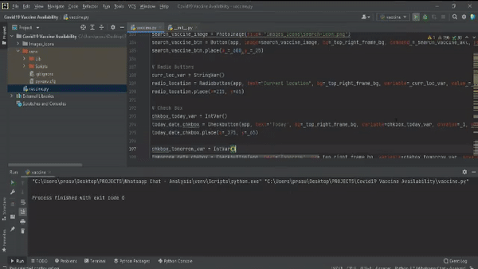

# Covid - 19 Vaccine Availability

## Software

##### PyCharm

## Packages 

##### 1) Tkinter (In order to import this, download the future package in Pycharm)
##### 2) Request
##### 3) Datetime
##### 4) Pytz

  
## Features

- Live Updates via API
- Get Vaccine Availability based on Pincode and Current Date

## To Run The Project

  Import the Folder into your Pycharm.

  Install all the Required Packages via the Python Interpreter Settings in PyCharm

  Run vaccine.py and check the Vaccine Availability at your Area and get Vaccinated. :syringe:

## Demo

